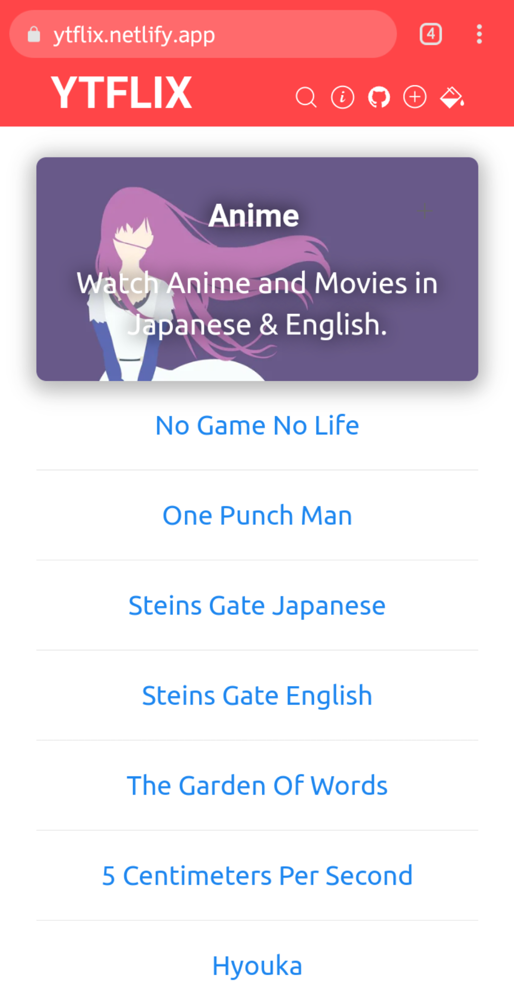

# YTFLIX

*YTFLIX is a library of movie and series content available on YouTube. It also enables the user to add content to the library and remove dead links by reporting. The main goal of YTFLIX is to provide the user with simple and clean interface to smoothly search free movies available on youtube.*
## Categories
- Originals
- Anime
- English
- Hindi

Each category consists of a list of names that are links to youtube videos.

## Screenshots
As of v2.1

## Dependencies
- [JSON SD](https://github.com/n-ce/JSON-static-database)
- [Sea-Arch](https://github.com/n-ce/Sea-Arch)
- [DarkMode](https://github.com/n-ce/DarkMode)
- [Formify](https://github.com/n-ce/Formify)

## Contributing
Anyone can add content links by clicking the plus icon available at the navbar in the site, sending both the title and URL at https://ytflix.netlify.app/
Or directly sending pull requests to the main branch with updated links dressed as JSON objects.
Instructions on updating the [databases](https://github.com/n-ce/YTFLIX/tree/main/Databases) : Paste link which comes after the "https://youtube.com/" part.
Your contribution is essential to the project.
